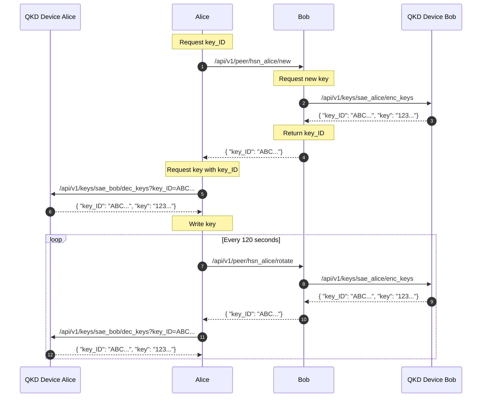

# uKMS - Micro Key Management System

> [!CAUTION]
> This document describes a proof-of-concept for demonstration purposes only.

This Key Management System (KMS) interfaces with (simulated) quantum key
distribution (QKD) endpoints as specified in [ETSI 014]. The primary function of
the KMS is to request keys from the QKD API and instruct the corresponding party
on which key ID to utilize.

> Quantum key distribution employs (entangled) quantum particles to generate key
> material through a fiber optic cable, making it physically impossible
> (citation needed) for eavesdropping on the quantum exchange. An attacker may
> only disrupt the exchange of key material, as photons can be "read" only once.

Upon every key change, _uKMS_ combines both keys, concatenates them, and applies
SHA3 hashing. The resultant hash is saved on both devices and serves as a
pre-shared key (PSK). Downstream applications can then utilize this key for
encryption and authentification purposes.

## Exchange Sequence

The diagram below outlines the key exchange process initiated by Alice. A
similar procedure is followed for Bob.



1. Alice contacts Bob's API endpoint `/new` to obtain a `key_ID` and prompts Bob
   to also request a new key.
2. Bob seeks a new key from his QKD device using the `/enc_keys` endpoint.
3. Bob's QKD device provides a fresh key and must then remove it from its storage.
4. Bob shares the `key_ID` with Alice.
5. Alice requests the specific key associated with the `key_ID` from her QKD device.
6. Alice's QKD device delivers the requested key and removes it from its storage.

The steps outlined are repeated at intervals defined by `key_rotation_seconds`,
except the `/rotate` endpoint is used now, as both key management systems
already have keys from both entities.

## Configuration

Configuration is managed through a [TOML] file, located either at
`/etc/ukms.toml` or a path specified by the `UKMS_CONFIG_FILE` environment
variable. The options within are explained inline.

> [!TIP]
> Some configurations (`source_KME_ID`, `master_SAE_ID`, etc.) may seem
> unfamiliar and are specifically relevant when integrating real QKD devices.
> For a simulated QKD device, it is essential to use identical identifiers on
> both ends, as demonstrated in `./example`.

```toml
key_rotation_seconds = 120 # Interval for key rotation
key_folder = "./psk/" # Directory for storing generated keys

ukms_bind = "localhost" # Interface/IP for UKMS binding
ukms_port = 5555 # Port for UKMS service

# For those without access to an expensive QKD setup, uKMS can simulate a QKD
# device. This mode generates keys based on the key_ID hash, making them
# available on both ends but completely insecure.
enable_fake_qkd_api = true

[peers]

[peers.hsn_bob] # Identifier must match target_KME_ID
etsi_url = "http://localhost:5555" # QKD device for key requests

ukms_url = "http://localhost:5556" # Peer uKMS address

alias = "bob" # Name for storing the key

# Refer to the ETSI documentation for detailed usage.
source_KME_ID = "hsn_alice" # Identifier for the "Key Management Entity" in operation
master_SAE_ID = "sae_alice" # Identifier for the "Secure Application Entity" in operation
slave_SAE_ID = "sae_bob" # Identifier for the "SAE" intended for communication
```

## Demonstration

Execute `ukms.py` using the three configuration files located in `./example`.

```shell
# shell 1
UKMS_CONFIG_FILE=example/ukms_alice.toml ./ukms.py

# shell 2
UKMS_CONFIG_FILE=example/ukms_bob.toml ./ukms.py

# shell 3
UKMS_CONFIG_FILE=example/ukms_carol.toml ./ukms.py
```

Shortly, you should observe the creation of the following files, which contain
identical keys in different locations. In a more complex demonstration, this
setup would operate across various devices, synchronizing over a local network.

- `./pks/alice/bob.key` <-> `./pks/bob/alice.key`
- `./pks/bob/carol.key` <-> `./pks/carol/bob.key`

Upon successful key exchange, a downstream application like [Wireguard] could
leverage these keys. Imagine configuring a `cronjob` to automatically update a
Wireguard connection with the exchanged keys as PSK.

> [!WARNING] 
> *uKMS* does not manage sessions, and there may be brief intervals where the
> keys differ. [Wireguard] incorporates its own session management and
> handshake mechanisms. Your downstream application should also address these
> aspects.

```shell
# on a device connected to bob
* * * * * wg set wg1 peer XYZ...ABC= preshared-key ./pks/bob/alice.key
```

## Why uKMS

Quantum computers pose a significant threat to conventional key exchange
mechanisms and public-key cryptography (citation needed). QKD aims to counter
this by enabling the continuous refresh of pre-shared keys at two locations,
facilitating secure encryption.

This software merely serves as a bridge, orchestrating the transfer of key
material provided by simulated QKD devices for subsequent use.

## What's Next

Remember, this is just a demonstration created within a limited time frame.
Neither the proposed _protocol_ nor its implementation is intended for actual
use cases. Future iterations could evolve this concept into a practical
application, but currently, it showcases the feasibility of a working system.

## Alternatives

Currently, *uKMS* is intended for demonstration purposes only. If you're seeking
genuine security measures against quantum computing threats, consider exploring
[Rosenpass] instead. It offers protection for [Wireguard] connections or
generates a key file in a manner similar to *uKMS*.

[ETSI 014]: https://www.etsi.org/deliver/etsi_gs/QKD/001_099/014/01.01.01_60/gs_qkd014v010101p.pdf
[TOML]: https://toml.io/
[Wireguard]: https://www.wireguard.com
[Rosenpass]: https://rosenpass.eu
